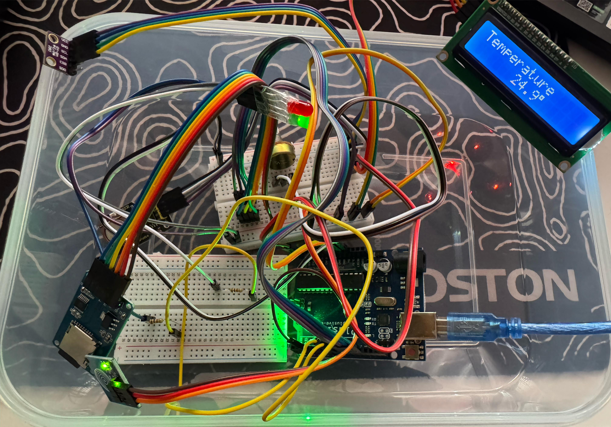

# Stație Meteo All-in-One 🌦️  

## 📌 Descriere pe scurt

Stația meteo integrează senzori și module embedded pentru a măsura, afișa, salva și transmite date de mediu:

- **Ce face:**  
  Măsoară temperatura, umiditatea și presiunea atmosferică (modul BME280), afișează valorile pe un LCD I²C, le transmite în timp real prin Serial Monitor și le salvează într-un fișier CSV pe un card microSD.

- **Scop:**  
  Integrarea a 4 interfețe embedded (ADC, I²C, 1-Wire, SPI + UART) într-un sistem funcțional, ușor de extins pentru aplicații IoT.

- **Utilitate:**  
  Sistem portabil pentru monitorizarea ambientală și arhivarea datelor.

---

## ⚙️ Module Hardware

- **Arduino Uno R3** – microcontroller principal  
- **GY-BME280** – senzor temperatură, umiditate, presiune  
- **LCD 16x2 I²C** – afișare informații  
- **MicroSD Module** – salvare date în fișier `log.csv`  
- **RTC DS3231** – ceas real-time  
- **RGB LED** – status vizual (verde = OK, roșu = alertă)  
- **TTP223 / buton** – comutare moduri  
- **Potentiometru** – setare prag temperatură  

> Notă: În simulări (ex. Wokwi), BME280 a fost înlocuit cu DHT22 și potențiometru pentru presiune.

---

## 🧠 Module Software

Scris în **Arduino IDE**, codul este organizat pe următoarele componente:

- **Sensor Drivers** – citire BME280 (I²C), ADC  
- **Data Processing** – conversie valori + logica de alertă  
- **Display Control** – actualizare text pe LCD  
- **LED RGB Control** – PWM pentru status temperatură  
- **SD Logging** – scriere fișier CSV  
- **Serial Monitor** – transmitere date live  
- **RTC Sync** – afișare oră și dată curentă

---

## 🔁 Moduri de operare

Comutarea se face prin apăsarea unui buton tactil:

1. **Temperature Mode** – °C afișat + transmis
2. **Threshold Mode** – prag setabil (0–50 °C)
3. **Humidity Mode** – %RH afișat + transmis
4. **Pressure Mode** – presiune (hPa)
5. **Clock Mode** – oră HH:MM cu cifre mari
6. **Date Mode** – zi + dată DD/MM/YYYY

> Alertele apar pe LCD și LED dacă temperatura depășește pragul.

---

## 💾 Logare pe SD Card

- La fiecare secundă: colectează temperatură, umiditate, presiune  
- La fiecare 10 secunde:
  - Calculează media valorilor
  - Scrie în `log.csv`:
    ```
    Date,Time,Temp,Hum,Pres
    2025-05-27,14:23:10,23.5,44.2,1013.6
    ```
  - Afișează: `Saved to SD!`

---

## 🧪 Componente folosite

| Componentă | Legături |
|------------|----------|
| **BME280** | I²C: SDA → A4, SCL → A5 |
| **LCD 16x2** | I²C: SDA → A4, SCL → A5 |
| **SD Module** | SPI: CS → D10, MOSI → D11, MISO → D12, SCK → D13 |
| **RTC DS3231** | I²C: SDA → A4, SCL → A5 |
| **RGB LED** | R → D4, G → D5, B → D6 |
| **TTP223 / Buton** | OUT → D2 |
| **Potentiometru** | OUT → A0 |

---

## 🖼️ Schema & Poze

- [Schema bloc](images/1.png)  
- [Schema electrică](images/2.png)  
- 

---

## 📚 Resurse

### 🔧 Software
- [Arduino IDE](https://www.arduino.cc/en/software)
- `Wire.h`, `SPI.h`, `SD.h`, `LiquidCrystal_I2C.h`, `Adafruit_BME280.h`, `RTClib.h`

### 📐 Hardware
- [BME280 Datasheet](https://cdn-shop.adafruit.com/datasheets/BST-BME280_DS001-10.pdf)
- [DS3231 Datasheet](https://datasheets.maximintegrated.com/en/ds/DS3231.pdf)

---

## ✅ Concluzii

Stația meteo prezentată reușește să integreze concepte esențiale din domeniul sistemelor embedded și să le transforme într-un instrument practic, ușor de extins și aplicabil în scenarii reale de monitorizare IoT.

---

